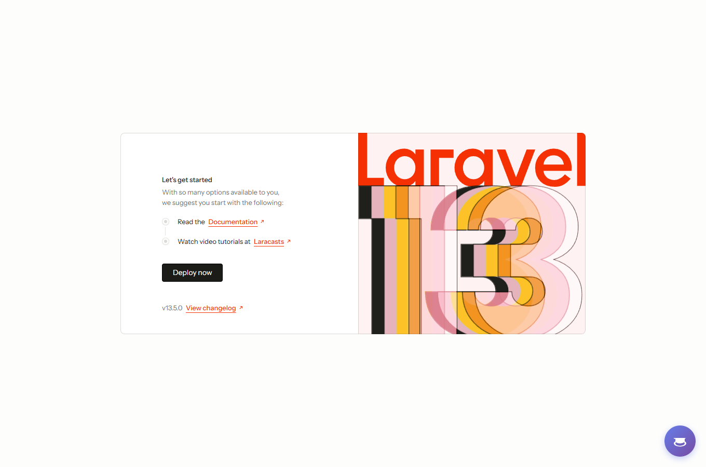
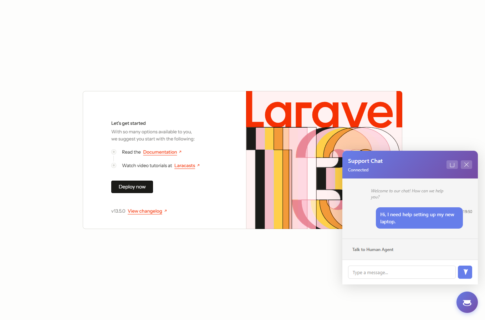
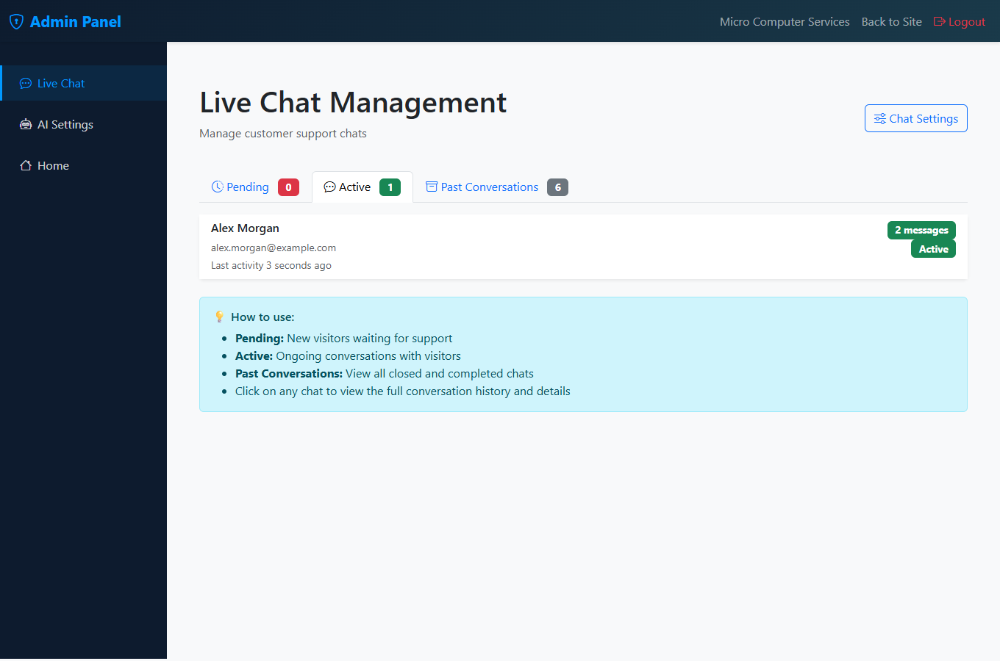
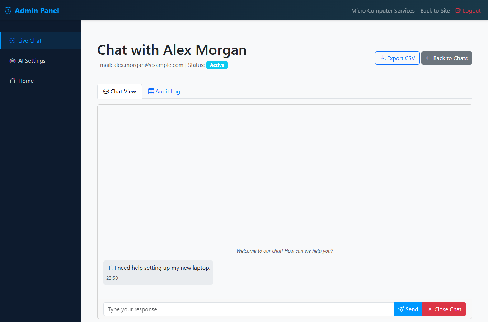
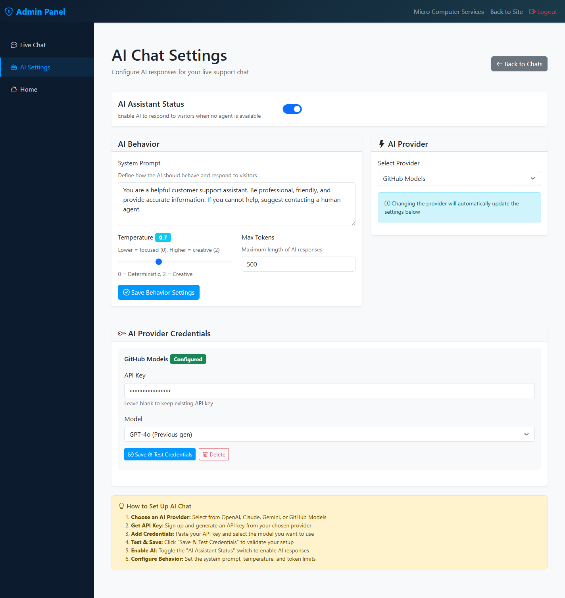

# Chat Widget Package for Laravel

[](https://github.com/jorodriguezpr/laravel-ai-chat)
[](https://laravel.com)
[](https://php.net)
[](LICENSE)

A comprehensive Laravel chat widget package with multi-provider AI support (OpenAI GPT-6/5.6, Claude 5, Gemini 3.8, GitHub Models).

## Screenshots

<table>
<tr>
<td width="50%">

**Visitor widget**


</td>
<td width="50%">

**Live conversation**


</td>
</tr>
<tr>
<td width="50%">

**Agent dashboard**


</td>
<td width="50%">

**Conversation view**


</td>
</tr>
<tr>
<td colspan="2">

**AI provider settings**


</td>
</tr>
</table>

## 📚 Complete Documentation

This package includes extensive documentation to help you get started quickly:

| Document | Description | Best For |
|----------|-------------|----------|
| **[PACKAGE_INDEX.md](PACKAGE_INDEX.md)** | 📋 Complete documentation index | Overview of all docs |
| **[QUICK_START.md](QUICK_START.md)** | ⚡ 3-minute installation guide | Fast setup |
| **[INSTALLATION.md](INSTALLATION.md)** | 📖 Detailed installation guide | Step-by-step setup |
| **[INSTALLATION_CHECKLIST.md](INSTALLATION_CHECKLIST.md)** | ✅ Complete installation checklist | Verification & testing |
| **[DEPLOYMENT.md](DEPLOYMENT.md)** | 🚀 Production deployment guide | Going live |
| **[COMPOSER_SETUP.md](COMPOSER_SETUP.md)** | 📦 Package distribution guide | Publishing to Packagist/Satis |
| **[USAGE_EXAMPLES.md](USAGE_EXAMPLES.md)** | 💡 Code examples | Learning the API |
| **[TROUBLESHOOTING.md](TROUBLESHOOTING.md)** | 🔧 Common issues & solutions | Fixing problems |
| **[CHANGELOG.md](CHANGELOG.md)** | 📝 Version history | What's new |

**New to this package?** Start with **[QUICK_START.md](QUICK_START.md)** for a 3-minute setup!

**Installing in production?** Follow **[DEPLOYMENT.md](DEPLOYMENT.md)** for best practices!

**Distributing this package?** See **[COMPOSER_SETUP.md](COMPOSER_SETUP.md)** for Packagist/Satis setup!

---

## ✨ Features

### Core Features

- 💬 **Real-time chat widget** - Beautiful, responsive chat bubble interface
- 🤖 **Multi-provider AI support** - OpenAI, Claude, Gemini, GitHub Models with latest 2026 models
- 👥 **Agent management** - Pickup, respond to, and close chats
- 📊 **Conversation audit trail** - CSV export for compliance and training
- 🔐 **Encrypted credentials** - Secure API key storage
- 📱 **Responsive design** - Works on desktop, tablet, and mobile
- ⚡ **Live polling** - Real-time message sync (3-second intervals)
- 🎨 **Customizable** - Themes, positions, colors, and messages
- 🚀 **Auto-discovery** - Zero configuration setup
- 🔧 **Publishable assets** - Full customization control

### AI Providers & Models (2026 Current)

#### 🟢 OpenAI
- `gpt-6-astra` (default) - Latest flagship, most capable
- `gpt-5.6-sol` - Complex professional work
- `gpt-5.6-terra` - Balanced intelligence & cost
- `gpt-5.6-luna` - Cost-sensitive workloads
- `gpt-5.4`, `gpt-5.4-mini` - Previous generation
- `gpt-4o`, `gpt-4o-mini` - Legacy

#### 🔵 Claude (Anthropic)
- `claude-sonnet-5` (default) - Balanced performance
- `claude-opus-5` - Maximum capability
- `claude-fable-5-1` - Most capable, advanced reasoning
- `claude-haiku-4-5-20251001` - Fast responses
- `claude-opus-4-6`, `claude-sonnet-4-6` - Previous generation

#### 🟡 Gemini (Google)
- `gemini-3.8-flash` (default) - Latest, most intelligent Flash model
- `gemini-3.1-pro-preview` - Most capable, complex reasoning
- `gemini-3.7-flash`, `gemini-3.6-flash` - Previous generation
- `gemini-3.5-flash-lite` - Fastest, most cost-effective
- `gemini-2.5-flash`, `gemini-2.5-pro`, `gemini-2.5-flash-lite` - Legacy

#### 🟣 GitHub Models
- `gpt-5.4`, `gpt-5.4-mini` - OpenAI via GitHub
- `deepseek-r1` - Reasoning specialist
- `grok-3`, `grok-3-mini` - xAI models
- `llama-3-70b` - Meta's open model
- `mistral-large` - Mistral AI
- `phi-4` - Microsoft's efficient model

> ⚠️ GitHub Models catalog IDs were **not** updated in this pass — GitHub's model marketplace requires an authenticated browse to confirm current catalog IDs, so these entries are unverified as of 2026-09-11. Check the [GitHub Models catalog](https://github.com/marketplace/models) before relying on newer IDs there.

**OpenAI, Claude, and Gemini models updated to their 2026-09 current versions.** ✅

## Requirements

- PHP 8.1+
- Laravel 10, 11, 12, or 13
- Composer

## Installation

### Quick Setup

```bash
composer require microrepairnet/laravel-ai-chat
php artisan chat-widget:install
```

The service provider auto-registers (Laravel package auto-discovery), so
`composer require` alone wires up the routes, views, and migrations. Running
`chat-widget:install` on top of that:

- Publishes `config/chat-widget.php`
- Adds any missing `.env` keys (`CHAT_WIDGET_ENABLED`, `AI_CHAT_ENABLED`, `AI_CHAT_PROVIDER`)
- Runs the package migrations
- Prints the widget `@include` snippet and the admin panel URLs

Add the widget to any page your visitors use:

```blade
@include('chat-widget::widget')
```

Manage live chats and configure AI providers at `/admin/live-chat` and
`/admin/ai-settings`. Protect those routes for production by setting your own
`admin_middleware` in `config/chat-widget.php` (defaults to `['web']` with no
authentication - see Configuration below).

### Optional: Publish Assets for Customization

The default install above needs no publishing - the package ships its own
self-contained admin views and routes. Publish these tags only if you want to
eject and customize the underlying files:

```bash
# Configuration only
php artisan vendor:publish --tag="chat-widget-config"

# Views only (templates) - copied to resources/views/vendor/chat-widget/
php artisan vendor:publish --tag="chat-widget-views"

# Admin/API routes only - copied to routes/chat-widget.php and routes/chat-widget-admin.php
php artisan vendor:publish --tag="chat-widget-routes"

# Controllers only (logic) - copied to app/Http/Controllers/ChatWidget/
php artisan vendor:publish --tag="chat-widget-controllers"

# Models only (database) - copied to app/Models/ChatWidget/
php artisan vendor:publish --tag="chat-widget-models"

# Migrations only
php artisan vendor:publish --tag="chat-widget-migrations"

# Everything above at once
php artisan vendor:publish --provider="Microrepairnet\ChatWidget\Providers\ChatWidgetServiceProvider" --tag="chat-widget"
```

Publishing `chat-widget-controllers` or `chat-widget-models` copies the
package's own `Microrepairnet\ChatWidget\...` classes into your app tree, so
you'll also need a matching PSR-4 autoload entry in your app's `composer.json`
pointing that namespace at the new path (see `COMPOSER_SETUP.md`).

## Configuration

### config/chat-widget.php

The package publishes a configuration file. Key settings:

```php
'enabled' => env('CHAT_WIDGET_ENABLED', true),

'ai' => [
    'enabled' => env('AI_CHAT_ENABLED', false),
    'default_provider' => env('AI_CHAT_PROVIDER', 'openai'),
    'providers' => [
        'openai' => [...],
        'claude' => [...],
        'gemini' => [...],
        'github' => [...],
    ],
],

'widget' => [
    'position' => env('CHAT_WIDGET_POSITION', 'bottom-right'),
    'theme' => env('CHAT_WIDGET_THEME', 'light'),
    'title' => env('CHAT_WIDGET_TITLE', 'Chat with us'),
    'subtitle' => env('CHAT_WIDGET_SUBTITLE', 'We typically reply in minutes'),
],
```

### Environment Variables

Add to your `.env` file:

```env
# Chat Widget
CHAT_WIDGET_ENABLED=true
CHAT_WIDGET_POSITION=bottom-right
CHAT_WIDGET_THEME=light
CHAT_WIDGET_TITLE="Chat with us"
CHAT_WIDGET_SUBTITLE="We typically reply in minutes"

# AI Chat
AI_CHAT_ENABLED=true
AI_CHAT_PROVIDER=openai
```

## Usage

### ⚠️ Required: CSRF Token

Your layout **must** include the CSRF token in the `<head>` section:

```blade
<head>
    <!-- ... other meta tags ... -->
    <meta name="csrf-token" content="{{ csrf_token() }}">
</head>
```

Without this, the chat widget will not be able to send messages.

### For Site Visitors

Include the chat widget on your pages:

```blade
<!-- In your layout or template -->
@include('chat-widget::widget')
```

The widget will automatically:
- Create a chat bubble in the bottom-right corner
- Allow visitors to start conversations
- Display AI responses if enabled
- Stream new messages in real-time

### For Admin/Agents

The package includes admin routes and views for managing conversations.

Routes available at:
- `/admin/live-chat` - View all conversations
- `/admin/live-chat/{chat}` - View conversation details with audit trail
- `/admin/ai-settings` - Configure AI providers

### Using the AIChatService in your code

```php
use Microrepairnet\ChatWidget\Services\AI\AIChatService;

// Inject the service
public function __construct(AIChatService $aiService)
{
    $this->aiService = $aiService;
}

// Check if AI is enabled
if ($this->aiService->isEnabled()) {
    // Send message to AI
    $response = $this->aiService->sendMessage(
        'User message',
        $conversationHistory // optional array of previous messages
    );
}
```

## Database Tables

The package creates the following tables:

### live_chats
- `id` - Primary key
- `user_id` - User who initiated chat (optional)
- `agent_id` - Assigned agent (optional)
- `visitor_email` - Visitor email
- `visitor_name` - Visitor name
- `visitor_ip` - Visitor IP address
- `status` - pending, active, or closed
- `is_agent_online` - Boolean flag
- `created_at`, `updated_at` - Timestamps

### chat_messages
- `id` - Primary key
- `live_chat_id` - Reference to chat
- `user_id` - User who sent message (optional)
- `sender_type` - visitor, agent, ai, or system
- `message` - Message content
- `is_read` - Boolean flag
- `created_at`, `updated_at` - Timestamps

### ai_chat_settings
- `id` - Primary key
- `enabled` - Enable/disable AI
- `provider` - Active provider (openai, claude, gemini, github)
- `system_prompt` - AI system instructions
- `temperature` - AI temperature (0-1)
- `max_tokens` - Max response tokens
- `created_at`, `updated_at` - Timestamps

### ai_provider_credentials
- `id` - Primary key
- `provider` - Provider name
- `api_key` - Encrypted API key
- `model` - Model/variant to use
- `additional_config` - Optional JSON config
- `is_active` - Currently active provider
- `created_at`, `updated_at` - Timestamps

## Models

The package provides these models in the `Microrepairnet\ChatWidget\Models` namespace:

```php
use Microrepairnet\ChatWidget\Models\LiveChat;
use Microrepairnet\ChatWidget\Models\ChatMessage;
use Microrepairnet\ChatWidget\Models\AIChatSetting;
use Microrepairnet\ChatWidget\Models\AIProviderCredential;

// Example: Get active chats with messages
$chats = LiveChat::where('status', 'active')->with('messages')->get();

// Add a message to a chat
$chat->addMessage('Hello!', ChatMessage::SENDER_VISITOR);

// Check AI settings
$settings = AIChatSetting::current();
```

## API Endpoints

### Chat Widget API (Public)

- `POST /api/chat/initiate` - Start a new chat
- `POST /api/chat/{chat}/message` - Send visitor message
- `GET /api/chat/{chat}/messages` - Get chat messages
- `POST /api/chat/{chat}/close` - Close chat

### AI API (Public)

- `GET /api/ai/status` - Check if AI is enabled
- `POST /api/ai/{chat}/response` - Get AI response
- `POST /api/ai/{chat}/request-human` - Request human agent

### Admin API (Protected)

- `GET /admin/api/live-chat/chats` - Get all chats
- `GET /admin/api/live-chat/{chat}/messages` - Get chat messages
- `POST /admin/live-chat/{chat}/message` - Send agent message
- `POST /admin/live-chat/{chat}/close` - Close chat

## Configuring AI Providers

### OpenAI

1. Get API key from https://platform.openai.com/api-keys
2. Go to `/admin/ai-settings`
3. Select OpenAI provider
4. Add API key
5. Choose model:
   - **gpt-5.4** (Latest flagship - April 2026)
   - gpt-5.4-mini (Fast & affordable)
   - gpt-5.4-nano (Cheapest high-volume)
   - gpt-4o (Previous generation, still capable)
   - gpt-4o-mini (Previous gen, faster)
   - o1 (Previous gen advanced reasoning)

### Claude (Anthropic)

1. Get API key from https://console.anthropic.com/
2. Go to `/admin/ai-settings`
3. Select Claude provider
4. Add API key
5. Choose model:
   - **claude-sonnet-4-6** (Latest Claude 4 - April 2026, best balance)
   - claude-opus-4-6 (Most intelligent broadly available)
   - claude-haiku-4-5-20251001 (Fastest with near-frontier intelligence)
   - claude-3-5-sonnet-20241022 (Legacy Claude 3.5)

### Gemini (Google)

1. Get API key from https://makersuite.google.com/app/apikey
2. Go to `/admin/ai-settings`
3. Select Gemini provider
4. Add API key
5. Choose model:
   - **gemini-2.5-flash** (Latest stable - April 2026, best price/performance)
   - gemini-2.5-pro (Most capable Gemini 2.5)
   - gemini-2.5-flash-lite (Fastest & most budget-friendly)
   - gemini-3.1-pro-preview (NEW - Gemini 3 advanced intelligence)
   - gemini-3-flash-preview (NEW - Frontier-class performance)

⚠️ Note: Gemini 2.0 models are deprecated. Please use 2.5 or 3.x series.

### GitHub Models

1. Get token from https://github.com/settings/tokens
2. Go to `/admin/ai-settings`
3. Select GitHub Models provider
4. Add token
5. Choose model:
   - **gpt-5.4** (Latest OpenAI - April 2026)
   - gpt-5.4-mini (Fast OpenAI)
   - gpt-4o (Previous gen OpenAI)
   - deepseek-r1 (Open reasoning model)
   - grok-3 (xAI's powerful model)
   - grok-3-mini (xAI's fast model)
   - llama-3-70b (Large open-source)
   - llama-3-8b (Fast open-source)
   - mistral-large (Powerful open-source)
   - phi-4 (Efficient Microsoft model)

## Customization

### Custom Views

Publish views to customize:

```bash
php artisan vendor:publish --provider="Microrepairnet\ChatWidget\Providers\ChatWidgetServiceProvider" --tag="chat-widget-views"
```

Views are published to `resources/views/vendor/chat-widget/`

### Custom Configuration

Edit `config/chat-widget.php` to change:
- Table names
- AI provider settings
- Widget appearance (position, theme, text)
- Message polling interval
- Maximum message length

## Troubleshooting

### AI responses not working

1. Check `AI_CHAT_ENABLED=true` in `.env`
2. Verify API credentials in admin settings
3. Check Laravel logs: `storage/logs/laravel.log`
4. Ensure credentials are validated via the admin UI

### Chats not appearing

1. Ensure migrations ran: `php artisan migrate`
2. Check database connection
3. Verify table names in `config/chat-widget.php`
4. Check if `CHAT_WIDGET_ENABLED=true`

### Messages not syncing

1. Check message polling interval (default 2000ms)
2. Ensure API endpoints are accessible
3. Check browser console for JavaScript errors
4. Verify CSRF token is present

## Testing

```bash
# Run package tests
composer test

# Run tests with coverage
composer test -- --coverage
```

## License

MIT License. See LICENSE file for details.

## Support

For issues, feature requests, or contributions, please visit:
- **Website**: https://www.microrepair.net
- **Email**: jrpcone@gmail.com
- **Author**: Jose Rodriguez Arroyo

## Changelog

### Version 1.1.0 - April 11, 2026 ✅
- **CRITICAL**: Updated Gemini provider (2.0 deprecated → 2.5/3.x series)
- **Major**: Updated OpenAI provider to GPT-5.4 (latest flagship)
- **Major**: Updated Claude provider to Claude 4 series (opus-4-6, sonnet-4-6, haiku-4-5)
- **Enhancement**: Expanded GitHub Models catalog (DeepSeek-R1, Grok-3, GPT-5.4)
- **Documentation**: All models verified from official provider websites
- **Compatibility**: Maintained backward compatibility (except Gemini 2.0)
- See `AI_MODELS_UPDATE_LATEST.md` for complete migration guide

### Version 1.0.0
- Initial release
- Multi-provider AI support
- Admin chat management
- Conversation audit trail
- CSV export functionality
